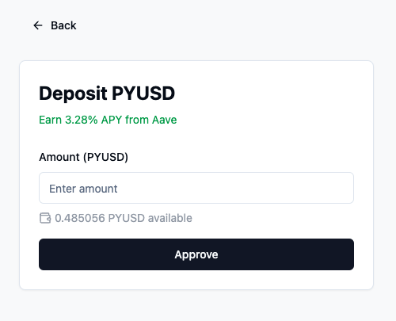

# PyPouch

PyPouch is a smart contract designed to facilitate the management of PYUSD savings by interfacing directly with Aave. Users can seamlessly deposit and withdraw PYUSD while earning yield, with automated yield accounting through on-chain transaction checkpoints.


## Overview

PyPouch simplifies DeFi savings management by providing:

- **Automated Yield Tracking**: Every transaction (deposit, withdraw, send, receive) creates a checkpoint that calculates and logs interest earned
- **Direct Aave Integration**: Seamlessly deposit and withdraw PYUSD to earn yield from Aave
- **User-Friendly Interface**: Simple UI for managing deposits, withdrawals, and transfers
- **Real-Time APY Display**: Shows current yield rates from Aave
- **Transaction History**: Track all your deposit, withdrawal, and transfer activities

## Features

### Deposit and Withdraw
- Deposit PYUSD to start earning yield immediately
- Withdraw anytime with automatically calculated interest
- Real-time balance and APY updates



### Send and Receive
- Transfer PYUSD to other users directly
- Generate QR codes for easy receiving
- Automatic yield calculations on transfers

### Yield Tracking
- On-chain events log interest earned between transactions
- Transparent and immutable record of all earnings
- No manual calculations needed

## Technical Architecture

PyPouch consists of:

- Smart contract interfacing with Aave
- React-based frontend with Web3 integration
- Event-driven yield accounting system

### Smart Contract Components
- Deposit function for Aave integration
- Withdraw function with yield calculations
- Transfer functions with balance recalculation
- Event emission for yield tracking

## Future Development

Planned features include:

- Support for additional Aave-listed assets
- Borrowing functionality against deposited savings
- Credit delegation integration with institutional lenders
- Enhanced yield optimization strategies

## Getting Started

1. Connect your wallet using the connect button
2. Ensure you have PYUSD in your wallet
3. Use the Deposit button to start earning yield
4. Monitor your earnings in real-time
5. Withdraw or transfer funds as needed

## Development Setup

```bash
# Install dependencies
npm install

# Start development server
npm run dev

# Build for production
npm run build
```

## Contributing

Contributions are welcome! Please feel free to submit a Pull Request.

## License

This project is licensed under the MIT License - see the LICENSE file for details.